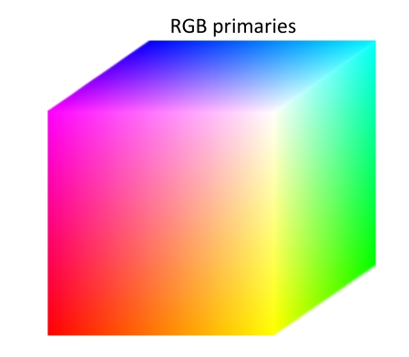
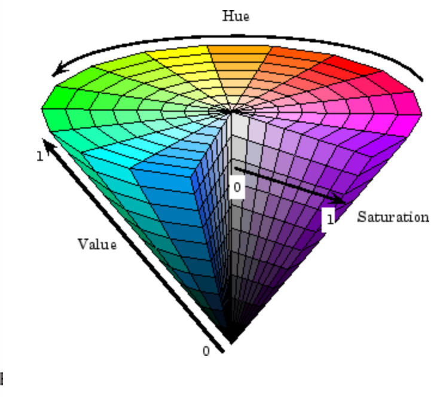

# Filter

## Color

Linear color space：

* RGB space：

  

Nonlinear color space：

* HSV

  

  

## Image sampling and quantization

Type of Images:

1. Binary
2. Gray Scale
3. Color

DPI：dots per inch，a sampling parameter

Images are Sampled and Quantized !

## Image histograms

```python
def histogram(im):
    h = np.zeros(255)
    for row in im.shape[0]:
        for col in im.shape[1]:
            val = im[row, col]
            h[val] += 1
```

Histogram of an image provides the frequency of the brightness (intensity) value in the image.

## Image as functions

* Images as discrete functions
* Images as coordinates
* An Image as a function f from $R^2$ to $R^M$

## Linear systems(Filters)

Filtering : Forming a new image whose pixel values are transformed from original pixel values.
$$
f[n,m] \stackrel{S}{\longrightarrow} g[n, m]
$$


Goal : extract useful information from images, or transform images into another domain where we can modify/enhance image properties.

Amplitude properties:

* Additivity : $S[f_i[n,m] + f_j[n,m]] = S[f_i[n,m]] + S[f_j[n,m]]$
* Homogeneity : $S[\alpha f_i[n,m]] = \alpha S[f_i[n,m]]$
* Superposition : $S[\alpha f_i[n,m] + \beta f_j[n,m]] = \alpha S[f_i[n,m]] + \beta S[f_j[n,m]]$
* Stability : $|f[n,m]| \leq k \to |g[n,m]| \leq ck$
* Invertibility : $S^{-1}[S[f_i[n,m]]] = f_i[n,m]$

Spatial properties

* Causality : for $n<n_0,m<m_0,$ if $f[n,m] = 0 \to g[n,m]=0$
* Shift invariance : $f[n-n_0,m-m_0] \stackrel{S}{\longrightarrow} g[n-n_0, m-m_0]$

Linear shift invariant (**LSI**)systems : Superposition property, Shift invariance

2D impulse function : 
$$
\delta_2[n,m] = \left\{\begin{matrix}
 1 & n=0,m=0\\
 0 & other
\end{matrix}\right.
$$
A delta function through a LSI system:
$$
\delta_2[n,m] \stackrel{S}{\longrightarrow} h[n, m]
$$
Linear shift invariant system : 
$$
\begin{aligned}
S\left[\sum_{k=-\infty}^{\infty} \sum_{l=\infty}^{\infty} f[k, l] \times \delta_{2}[n-k, m-l]\right].=& \sum_{k=-\infty}^{\infty} \sum_{l=\infty}^{\infty} f[k, l] \times S\left[\delta_{2}[n-k, m-l]\right] \\
&=\sum_{k=-\infty}^{\infty} \sum_{l=\infty}^{\infty} f[k, l] \times h[n-k, m-l]
\end{aligned}
$$
An LSI system is completely specified by its impulse response.
$$
f[n,m] \stackrel{SLSI}{\longrightarrow} \sum_{k=-\infty}^{\infty} \sum_{l=\infty}^{\infty} f[k, l] \times h[n-k, m-l]
$$
Discrete convolution : 
$$
S[f] = f[n,m] * h[n,m]
$$

## Convolution and correlation

* A convolution is an integral that expresses the amount of overlap of one function as it is shifted over another function.
* Correlation compares the similarity of two sets of data. 