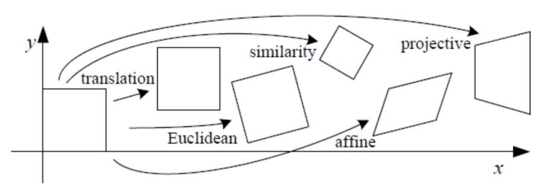
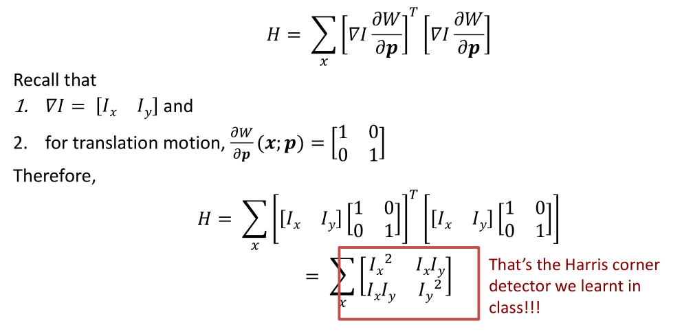

# Tracking

## Feature Tracking

Challenges in Feature tracking：

* Figure out which features can be tracked
* Some points may change appearance over time
* Drift: small errors can accumulate as appearance model is updated
* Points may appear or disappear.

Good features to track:

* Can measure “quality” of features from just a single image.
* Hence: tracking Harris corners (or equivalent) guarantees small error sensitivity!

Optical flow can help track features

## Simple KLT tracker

Simple KLT tracker

1. Find a good point to track (harris corner)
2. For each Harris corner compute motion (translation or affine) between consecutive frames.
3. Link motion vectors in successive frames to get a track for each Harris point
4. Introduce new Harris points by applying Harris detector at every m (10 or 15) frames
5. Track new and old Harris points using steps 1-3

## 2D transformations

Types of 2D transformations:

* translation
* Euclidean
* similarity
* affine
* projective

### Translation

$$
x' = x + b_1 \\
y' = y + b_2
$$

Matrix form:
$$
\begin{bmatrix}
x' \\
y'
\end{bmatrix}=
\begin{bmatrix}
1 & 0 & b_1 \\
0 & 1 & b_2
\end{bmatrix}
\begin{bmatrix}
x \\ y \\ 1
\end{bmatrix} \rightarrow W(x;p)=
\begin{bmatrix}
1 & 0 & b_1 \\
0 & 1 & b_2
\end{bmatrix}
\begin{bmatrix}
x \\ y \\ 1
\end{bmatrix}
$$
Where:
$$
p=\begin{bmatrix}
b_1 \\ b_2
\end{bmatrix}
$$
The derivative of the transformation w.r.t. $p$:
$$
\frac{\part W}{\part p}(x;p) =
\begin{bmatrix}
1 & 0 \\ 0 & 1
\end{bmatrix}
$$

### Similarity motion

* Rigid motion includes scaling + translation.
  $$
  x' = ax + b_1 \\
  y' = ay + b_2
  $$

* $$
  W(x;p)=\begin{bmatrix}
  a & 0 & b_1 \\
  0 & a & b_2
  \end{bmatrix}
  \begin{bmatrix}
  x \\ y \\ 1
  \end{bmatrix}
  $$

* $$
  p=\begin{bmatrix}
  a \\ b_1 \\ b_2
  \end{bmatrix}
  $$

* $$
  \frac{\part W}{\part p}(x;p) =
  \begin{bmatrix}
  x & 1 & 0 \\y & 0 & 1
  \end{bmatrix}
  $$

### Affine motion

* Affine motion includes scaling + rotation + translation.
  $$
  x' = a_1x+a_2y+b_1 \\
  y' = a_3x+a_4y+b_2
  $$

* $$
  W(x;p)=\begin{bmatrix}
  a_1 & a_2 & b_1 \\
  a_3 & a_4 & b_2
  \end{bmatrix}
  \begin{bmatrix}
  x \\ y \\ 1
  \end{bmatrix}
  $$

* $$
  p=\begin{bmatrix}
  a_1 \\ a_2 \\ b_1 \\ a_3 \\ a_4 \\ b_2
  \end{bmatrix}
  $$

* $$
  \frac{\part W}{\part p}(x;p) =
  \begin{bmatrix}
  x & y & 1 & 0 & 0 & 0 \\0 & 0 & 0 & x & y & 1
  \end{bmatrix}
  $$

## Iterative KLT tracker

### Problem setting

* Given a video sequence, find all the features and track them across the video.
* First, use Harris corner detection to find features and their location $\mathbf{x}$.
* For each feature at location $\mathbf{x}=[x, y]^T$:
  * Choose a descriptor create an initial template for that feature: $T(\mathbf{x})$

### KLT objective

* Our aim is to find the $p$ that minimizes the difference between the template $T(\mathbf{x})$ and the description of the new location of $\mathbf{x}$ after undergoing the transformation.
  $$
  \sum_{x} [I(W(x;p)) - T(x)]^2
  $$

* Taylor series is defined as
  $$
  f(x+\Delta x)=f(x)+\Delta x\frac{\part f}{\part x} + \Delta x^2\frac{\part^2 f}{\part x^2} +\dots
  $$
  Using Taylor series:
  $$
  \sum_{x} [I(W(x;p_0+\Delta p)) - T(x)]^2 \approx \sum_{x} [I(W(x;p_0)+\nabla I \frac{\part W}{\part p}\Delta p - T(x)]^2
  $$

* So our aim is to find the $\Delta p$ that minimizes the following:
  $$
  \arg\min_{\Delta p} \sum_{x} [I(W(x;p_0)+\nabla I \frac{\part W}{\part p}\Delta p - T(x)]^2
  $$
  Where $\nabla I = [I_x, I_y]$

* Differentiate wrt $\Delta p$ and setting it to zero:
  $$
  \sum_{x} [\nabla I \frac{\part W}{\part p}]^T[I(W(x;p_0)+\nabla I \frac{\part W}{\part p}\Delta p - T(x)]^2 = 0
  $$

* $$
  \Delta p = H^{-1}\sum_{x}[\nabla I \frac{\part W}{\part p}]^T[T(x)-I(W(x;p_0))]
  $$

  Where $H=\sum_x[\nabla I \frac{\part W}{\part p}][\nabla I \frac{\part W}{\part p}]^T$

* 

### Overall KLT tracker algorithm

Given the features from Harris detector:

1. Initialize $p_0$ and $\Delta p$.
2. Compute the initial templates $T(x)$ for each feature.
3. Transform the features in the image $I$ with $W(x;p_0)$ .
4. Measure the error: $T(W(x;p_0)) - T(x)$
5. Compute the image gradients $\nabla I=[I_x,I_y]$
6. Evaluate the Jacobian $\frac{\part W}{\part p}$
7. Compute steepest descent $\nabla I \frac{\part W}{\part p}$
8. Compute Inverse Hessian $H^{-1}$
9. Calculate the change in parameters $\Delta p$
10. Update parameters $p_0 = p_0 + \Delta p$
11. Repeat 2 to 10 until $\Delta p$ is small.