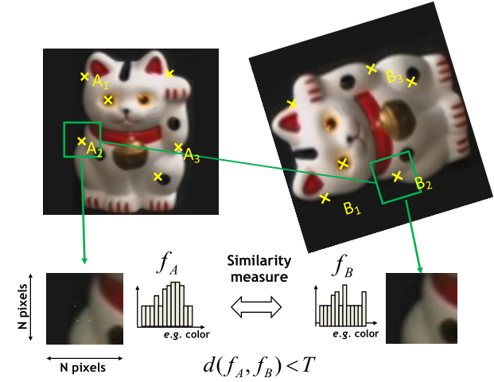
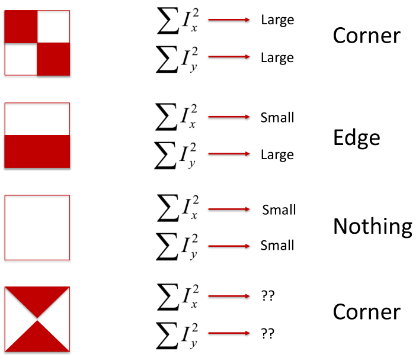
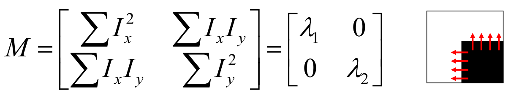
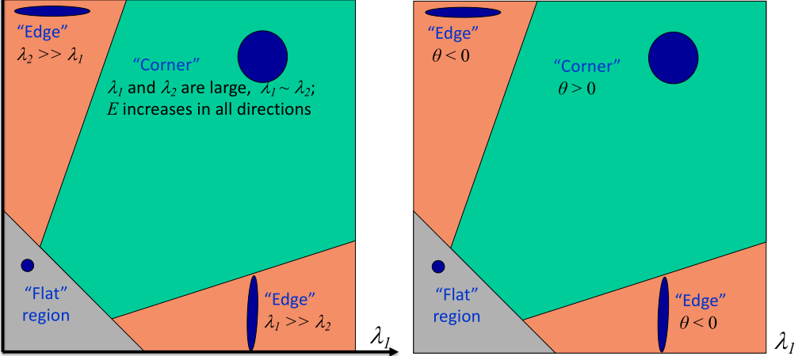
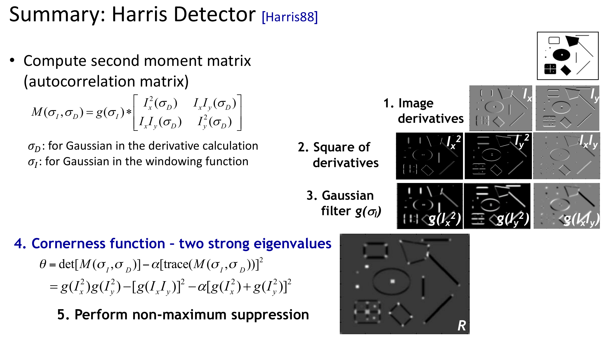
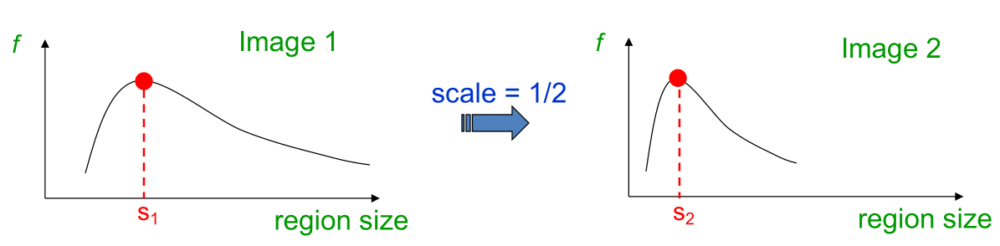
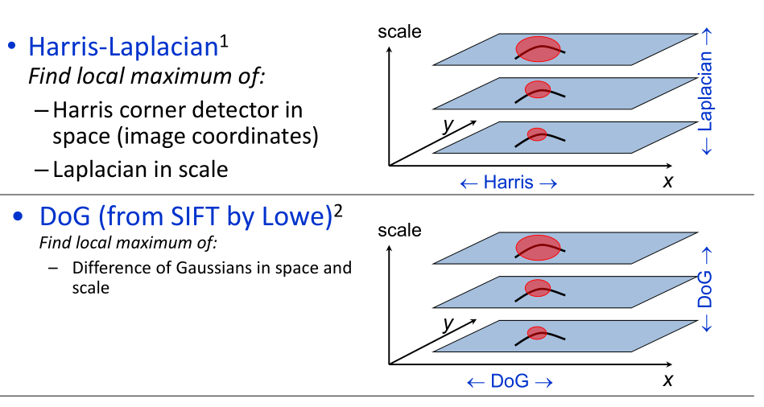
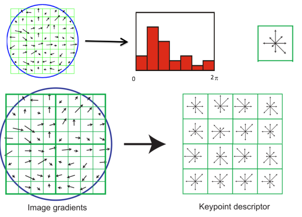
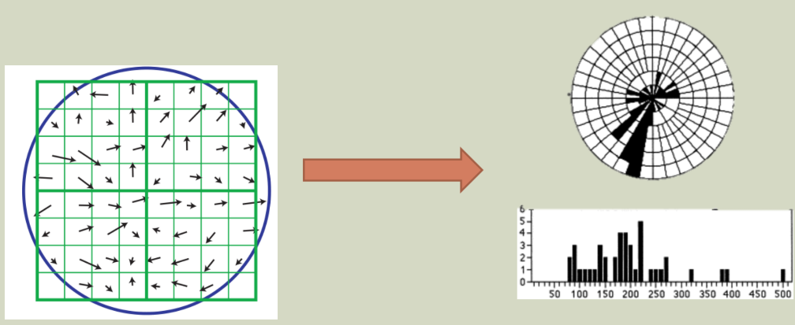

# Feature

## A model fitting method for line detection

Difficulty of Line Fitting ：

* Only some parts of each line detected, and some parts are missing
* Noise in measured edge points, orientations

RANSAC :

* RANdom SAmple Consensus
* Intuition: if an outlier is chosen to compute the current fit, then the resulting line won’t have much support from rest of the points.

RANSAC loop :

1. Randomly select a seed group of points on which to base transformation estimate
2. Compute transformation from seed group
3. Find inliers to this transformation
4. If the number of inliers is sufficiently large, re-compute least-squares estimate of transformation on all of the inliers

RANSAC :

* Define :
  * $w$ is fraction of inliers
  * $n$ points needed to define hypothesis
  * $k$ samples chosen
* Prob. that a single sample of $n$ points is correct: $w^n$
* Prob. that all $k$ samples fail is: $(1-w^n)^k$

## Local invariant features

Motivation for using local features :

* Global representations have major limitations
* Instead, describe and match only local regions
* Increased robustness to : Occlusions, Articulation, Articulation

General Approach :

1. Find a set of distinctive keypoints
2. Define a region around each keypoint
3. Extract and normalize the region content
4. Compute a local descriptor from the normalized region
5. Match local descriptors

Requirements :

* Region extraction needs to be **repeatable** and **accurate**
  * Invariant to translation, rotation, scale changes
  * Robust or covariant to out-of-plane transformations
  * Robust to lighting variations, noise, blur, quantization
* Locality: Features are local, therefore robust to occlusion and clutter.
* Quantity: We need a sufficient number of regions to cover the object.
* Distinctiveness: The regions should contain “interesting” structure.
* Efficiency: Close to real-time performance.

## Keypoint localization

Goals:

* Repeatable detection
* Precise localization
* Interesting content

### Harris corner detector

Key property : In the region around a corner, image gradient has two or more dominant directions.

Measure change as intensity difference: $I(x+u, y+v) - I(x, y)$

Harris Detector Formulation :
$$
E(u,v) = \sum_{x,y} w(x,y)[I(x+u, y+v) - I(x, y)]^2
$$
$w(x,y)$ is a Window function.

This measure of change can be approximated by :
$$
E(u,v) \approx 
\begin{bmatrix}
 u & v
\end{bmatrix}
M
\begin{bmatrix}
 u\\
v
\end{bmatrix}
$$
where M is a $2\times 2 $ matrix computed from image derivatives:
$$
M = \sum_{x,y} w(x,y)
\begin{bmatrix}
 I_x^2 & I_xI_y\\
I_xI_y & I_y^2
\end{bmatrix}
$$
An axis-aligned corner:

Eigenvalue decomposition :
$$
M = R^{-1}
\begin{bmatrix}
 \lambda_1 & 0\\
0 & \lambda_2
\end{bmatrix}
R
$$
Corner Response Function : 
$$
\theta = \det(M) - \alpha \text{trace}(M)^2 = \lambda_1 \lambda_2 - \alpha(\lambda_1+\lambda_2)^2
$$

Window function $w(x,y)$ :

*  window
  $$
  M = \sum_{x,y}
  \begin{bmatrix}
   I_x^2 & I_xI_y\\
  I_xI_y & I_y^2
  \end{bmatrix}
  $$
  
* Smooth with Gaussian
  $$
  M = g(\sigma )*
  \begin{bmatrix}
   I_x^2 & I_xI_y\\
  I_xI_y & I_y^2
  \end{bmatrix}
  $$
  

Harris Detector:

* Translation invariance
* Rotation invariance
* **NOT** Rotation invariance

## Scale invariant keypoint detection

* Design a function on the region (circle), which is “scale invariant”
* For a point in one image, we can consider it as a function of region size (circle radius)

Functions for determining scale : $ f = Kernel * Image$

Kernels:

* Laplacian
  $$
  L = \sigma^2 (G_{xx}(x,y,\sigma) + G_{yy}(x,y,\sigma))
  $$

* Difference of Gaussians (DOG)
  $$
  DoG = G(x,y,k\sigma)-G(x,y,\sigma)
  $$
  

Where
$$
G(x,y,\sigma) = \frac{1}{\sqrt{2\pi}\sigma}e^{-\frac{x^2+y^2}{2\sigma^2}}
$$

## SIFT: an image region descriptor

8 orientation bins per histogram, and a 4x4 histogram array, yields 8 x 4x4 = 128 numbers.

So a SIFT descriptor is a length 128 vector, which is invariant to rotation (because we rotated the descriptor) and scale (because we worked with the scaled image from DoG).

SIFT descriptor formation

* Invariant to changes in brightness
* normalize the vector
* Result is a vector which is fairly invariant to illumination changes.

## HoG: another image descriptor

Histogram of Oriented Gradients (HoG) :

Local object appearance and shape can often be characterized rather well by the distribution of local intensity gradients or edge directions.

* Dividing the image window into small spatial regions (cells)
* Cells can be either rectangle or radial.
* Each cell accumulating a weighted local 1-D histogram of gradient directions over the pixels of the cell.

* For better invariance to illumination and shadowing. it is useful to contrast-normalize the local responses before using them.
* Accumulate local histogram “energy” over a larger regions (“blocks”) to normalize all of the cells in the block.

Difference between HoG and SIFT

* HoG is usually used to describe entire images. SIFT is used for key point matching
* SIFT histrograms are oriented towards the dominant gradient. HoG is not.
* HoG gradients are normalized using neighborhood bins.
* SIFT descriptors use varying scales to compute multiple descriptors.