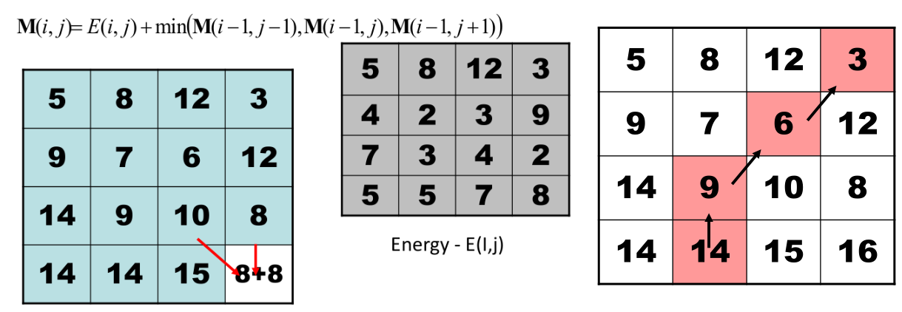

# Resizing

## Image resizing

Image Retargeting ：

* Problem statement:
  * Input: Image  $I \ n \times m$ and new size $n' \times m'$
  * Output: Image $I'$ of size $n' \times m'$ which will be “good representative” of the original image $I$

Importance Measures:

* A function S: $p\rightarrow [0,1]$

General Retargeting Framework :

1. Define an energy function $E(I)$ 
2. Use some operator(s) to change the image $I$

### Seam Carving

* Assume $m \times n \rightarrow m \times n', n'<n$

* Basic Idea: remove unimportant pixels from the image

  * Unimportant = pixels with less energy
    $$
    E_1(I)=|\frac{\part}{\part x}I|+|\frac{\part}{\part y}I|
    $$

* Intuition for gradient-based energy:

  * Preserve strong contours
  * Human vision more sensitive to edges
  * Simple enough for producing some nice results

A Seam : A connected path of pixels from top to bottom (or left to right). 
$$
s^x = \{s^x_i\}^n_{i=1} = \{(x(i),i)\}^n_{i=1},\quad s.t. \forall i, |x(i)-x(i-1)| \leq 1 \\
s^y = \{s^y_j\}^m_{j=1} = \{(j, y(j))\}^n_{j=1},\quad s.t. \forall j, |y(j)-y(j-1)| \leq 1
$$
The Optimal Seam :
$$
M(i,j) = E(i,j) + \min(M(i-1,j-1),M(i-1,j),M(i-1,j+1))
$$


The Seam-Carving Algorithm :

```pseudocode
SEAM-CARVING(im, n_ ) // size(im) = m x n
Do (n_ - n) times
	E <- Compute energy map on im
	s <- Find the optimal seam in im
	im <- Remove s from im
return im
```

Auxiliary Energy :

Instead of removing the seam of least energy, remove the seam that inserts the least energy to the image 
$$
C_L(i,j) = |I(i,j+1)-I(i,j-1)| + |I(i-1,j)-I(i,j-1)| \\
C_R(i,j) = |I(i,j+1)-I(i,j-1)| + |I(i-1,j)-I(i,j+1)| \\
C_V(i,j) = |I(i,j+1)-I(i,j-1)| 
$$
New Forward Looking Energy:
$$
M(i,j) = \min
\left\{\begin{matrix}
 M(i-1,j-1) + C_L(i,j)\\
 M(i-1,j)+C_U(i,j)\\
M(i-1,j+1)+C_R(i,j)
\end{matrix}\right.
$$

```python
#!/usr/bin/env python

"""
Usage: python carver.py <r/c> <scale> <image_in> <image_out>
Copyright 2018 Karthik Karanth, MIT License
"""

import sys

from tqdm import trange
import numpy as np
from imageio import imread, imwrite
from scipy.ndimage.filters import convolve

def calc_energy(img):
    filter_du = np.array([
        [1.0, 2.0, 1.0],
        [0.0, 0.0, 0.0],
        [-1.0, -2.0, -1.0],
    ])
    # 这会将它从2D滤波转换为3D滤波器
    # 为每个通道：R，G，B复制相同的滤波器
    filter_du = np.stack([filter_du] * 3, axis=2)

    filter_dv = np.array([
        [1.0, 0.0, -1.0],
        [2.0, 0.0, -2.0],
        [1.0, 0.0, -1.0],
    ])
    # 这会将它从2D滤波转换为3D滤波器
    # 为每个通道：R，G，B复制相同的滤波器
    filter_dv = np.stack([filter_dv] * 3, axis=2)

    img = img.astype('float32')
    convolved = np.absolute(convolve(img, filter_du)) + np.absolute(convolve(img, filter_dv))

    # 我们计算红，绿，蓝通道中的能量值之和
    energy_map = convolved.sum(axis=2)

    return energy_map

def crop_c(img, scale_c):
    r, c, _ = img.shape
    new_c = int(scale_c * c)

    for i in trange(c - new_c):
        img = carve_column(img)

    return img

def crop_r(img, scale_r):
    img = np.rot90(img, 1, (0, 1))
    img = crop_c(img, scale_r)
    img = np.rot90(img, 3, (0, 1))
    return img

def carve_column(img):
    r, c, _ = img.shape

    M, backtrack = minimum_seam(img)
    mask = np.ones((r, c), dtype=np.bool)

    j = np.argmin(M[-1])
    for i in reversed(range(r)):
        mask[i, j] = False
        j = backtrack[i, j]

    mask = np.stack([mask] * 3, axis=2)
    img = img[mask].reshape((r, c - 1, 3))
    return img

def minimum_seam(img):
    r, c, _ = img.shape
    energy_map = calc_energy(img)

    M = energy_map.copy()
    backtrack = np.zeros_like(M, dtype=np.int)

    for i in range(1, r):
        for j in range(0, c):
            # 处理图像的左侧边缘，确保我们不会索引-1
            if j == 0:
                idx = np.argmin(M[i-1, j:j + 2])
                backtrack[i, j] = idx + j
                min_energy = M[i-1, idx + j]
            else:
                idx = np.argmin(M[i - 1, j - 1:j + 2])
                backtrack[i, j] = idx + j - 1
                min_energy = M[i - 1, idx + j - 1]

            M[i, j] += min_energy

    return M, backtrack

def main():
    if len(sys.argv) != 5:
        print('usage: carver.py <r/c> <scale> <image_in> <image_out>', file=sys.stderr)
        sys.exit(1)

    which_axis = sys.argv[1]
    scale = float(sys.argv[2])
    in_filename = sys.argv[3]
    out_filename = sys.argv[4]

    img = imread(in_filename)

    if which_axis == 'r':
        out = crop_r(img, scale)
    elif which_axis == 'c':
        out = crop_c(img, scale)
    else:
        print('usage: carver.py <r/c> <scale> <image_in> <image_out>', file=sys.stderr)
        sys.exit(1)
 
    imwrite(out_filename, out)

if __name__ == '__main__':
    main()
```

