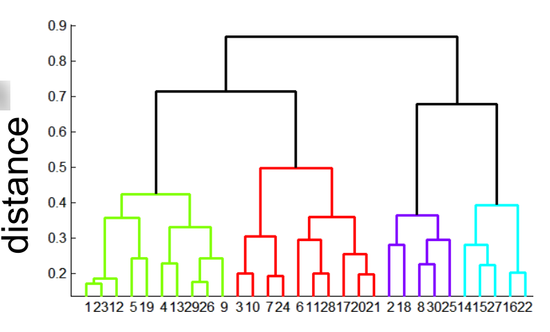

# Segmentation

# Introduction to segmentation and clustering

Image Segmentation: identify groups of pixels that go together

**One way to think about “segmentation” is Clustering**

Clustering: group together similar data points and represent them with a single token

Cluster:

* Summarizing data
  * Look at large amounts of data
  * Patch-based compression or denoising
  * Represent a large continuous vector with the cluster number
* Counting
  * Histograms of texture, color, SIFT vectors
* Segmentation
  * Separate the image into different regions
* Prediction
  * Images in the same cluster may have the same labels

## Agglomerative clustering

Clustering is an unsupervised learning method. Given items $x_1,\cdots,x_n \in \mathbb{R}^D$,  the goal is to group them into clusters. We need a pairwise distance/similarity function between items, and sometimes the desired number of clusters.

Let $x$ and $x’$ be two objects from the universe of possible objects. The distance (similarity) between $x$ and $x’$ is a real number denoted by $sim(x, x’)$.

* The Euclidean distance is defined as
  $$
  dist(x,x') = \sqrt{\sum(x_i-x_i')^2}
  $$

* The cosine similarity
  $$
  \begin{align}
  sim(x,x')&=cos(\theta)\\
  		 &=\frac{x^Tx'}{\|x\|\|x'\|} \\
  		 &= \frac{x^Tx'}{\sqrt{x^Tx}\sqrt{x'^Tx'}}
  \end{align}
  $$

Agglomerative Hierarchical Clustering Algorithm:

1. Initially each item $x_1, \cdots, x_n$ is in its own cluster $C_1,\cdots,C_n$

2. Repeat until there is only one cluster left:

   ​		Merge the nearest clusters, say $C_i$ and $C_j$

Different measures of nearest clusters:

* Single Link

  $d(C_i,C_j)=\min_{x\in C_i,x'\in C_j}d(x,x')$

* Complete Link

  $d(C_i,C_j)=\max_{x\in C_i,x'\in C_j}d(x,x')$

* Averge Link

  $d(C_i,C_j)=\frac{\sum{x\in C_i,x'\in C_j}d(x,x')}{|C_i||C_j|}$

## Oversegmentation

Graph-based clustering for Image Segmentation : 

Problem Formulation :

* Graph $G=(V,E)$
* $V$ is set of nodes
* $E$ is a set of undirected edges between pair of pixels
* $w(v_i,v_j)$ is the weight of the edge between nodes $v_i$ and $v_j$
* $S$ is a segmentation of a graph $G$ such that $G'=(V,E')$ where $E' \subset  E$
* $S$ divides $G$ into $G'$ such that it contains distinct clusters $C$

Predicate for segmentation:
$$
Merge(C_1,C_2) = 
\left\{\begin{matrix}
True  & if\quad dif(C_1,C_2) < in(C_1,C_2)\\
False  & otherwise
\end{matrix}\right. \\
dif(C_1,C_2) =\min_{v_i\in C_1,v_j\in C_2,(C_1,C_2)\in E} w(v_i,v_j)\\
in(C_1,C_2) =\min_{C\in \{C_1,C_2\}}\left[\max_{v_i,v_j}\left[w(v_i,v_j)+\frac{k}{|C|}\right]\right]
$$
Where:

* $dif(C_1,C_2)$ is the difference between two clusters.
* $in(C_1,C_2)$ is the internal difference in the clusters $C_1$ and $C_2$
* $\frac{k}{|C|}$ sets the threshold by which the components need to be different from the internal nodes in a component. Properties of constant $k$:
  * If $k$ is large, it causes a preference of larger objects.
  * $k$ does not set a minimum size for components.

