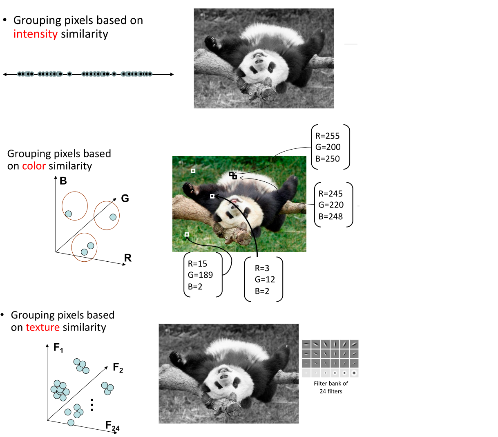
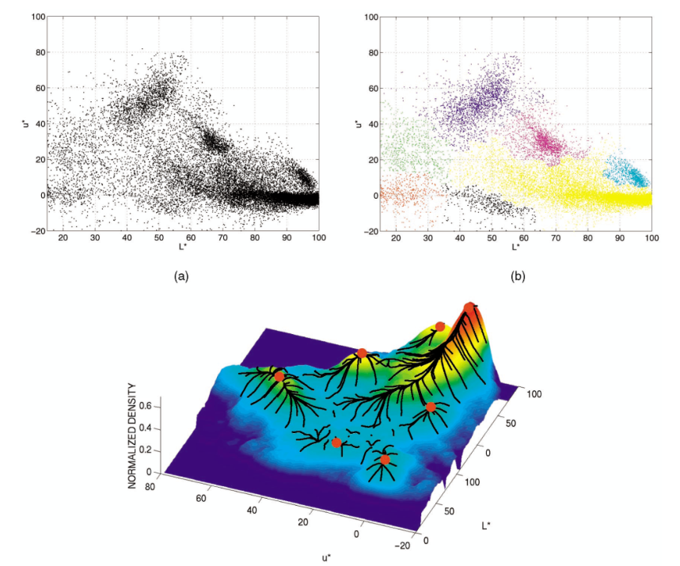
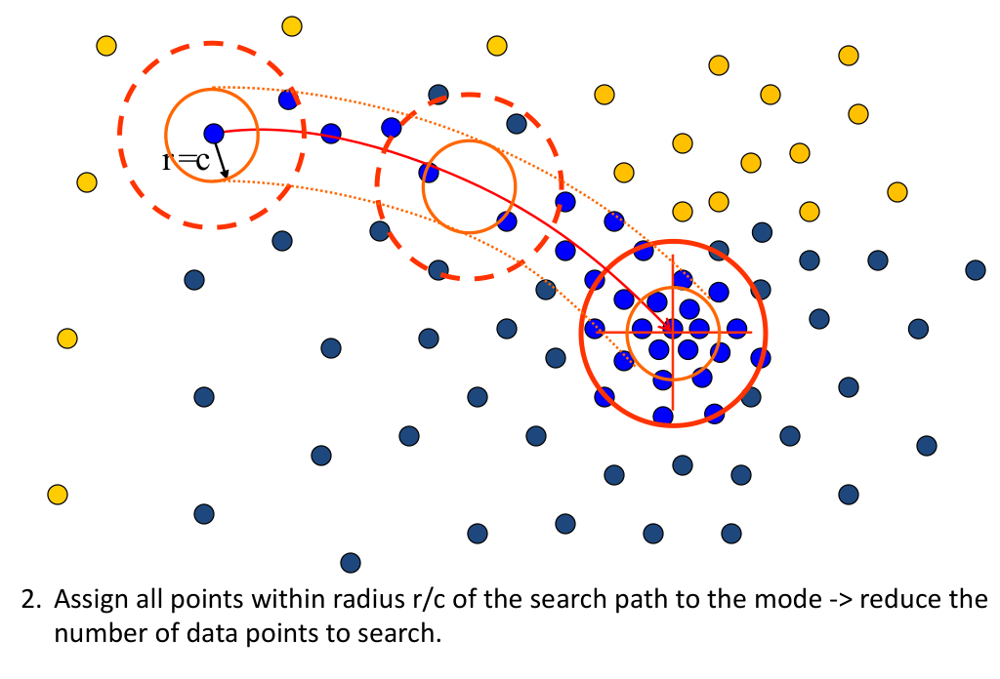

# Clustering

## K-means clustering

Clustering ：

* Goal: choose “centers” as the representative intensities, and label every pixel according to which of these centers it is nearest to.

* Best cluster centers are those that minimize Sum of Square Distance (SSD) between all points and their nearest cluster center $c_i$:
  $$
  SSD = \sum_{cluster\ i}\sum_{x\in cluster\ i}(x-c_i)^2
  $$

Clustering for Summarization

* Goal: cluster to minimize variance in data given clusters
  $$
  c^*,\delta^*=\arg\min_{c,\delta}\frac{1}{N}\sum_{j}^{N}\sum_{i}^{K}\delta_{ij}(c_i-x_j)^2
  $$

**K-means clustering**

1. Initialize$(t=0)$: cluster center $c_1,\cdots,c_k$

2. Compute $\delta^t$: assign each point to the closest center

   * $\delta^t$ denotes the set of assignment for each $x_j$ to cluster $c_i$ at iteration $t$
     $$
     \delta^t = \arg\min_{\delta}\frac{1}{N}\sum_{j}^{N}\sum_{i}^{K}\delta_{ij}^{t-1}(c_i^{t-1}-x_j)^2
     $$

3. Compute $c^t$: update cluster centers as the mean of the points
   $$
   c^t = \arg\min_{c}\frac{1}{N}\sum_{j}^{N}\sum_{i}^{N}\delta_{ij}^t(c_i^{t-1}-x_j)^2
   $$

4. Update $t=t+1$, repeat Step $2-3$ till stopped.

**K-Means++**

1. Randomly choose first center
2. Pick new center with prob.proportional to $(x-c_i)^2$
3. Repeat until K centers.

Feature space:

* Depending on what we choose as the feature space, we can group pixels in different ways.
  * Grouping pixels based on intensity similarity
  * Grouping pixels based on color similarity
  * Grouping pixels based on texture similarity

## Mean-shift clustering

1. Initialize random seed, and window W
2. Calculate center of gravity (the “mean”) of W: $\sum_{x\in W}xH(x)$
3. Shift the search window to the mean
4. Repeat Step 2 until convergence

Mean-Shift Clustering/Segmentation:

* Find features (color, gradients, texture, etc)
* Initialize windows at individual pixel locations
* Perform mean shift for each window until convergence
* Merge windows that end up near the same “peak” or mode

Problem： Computational Complexity

Method：

