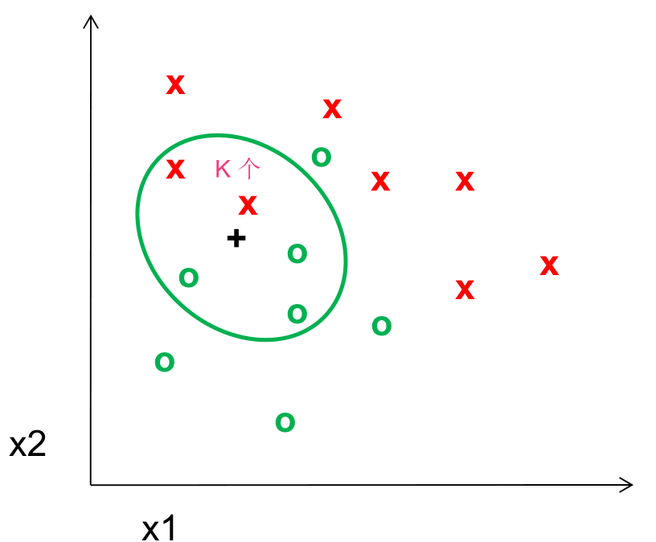
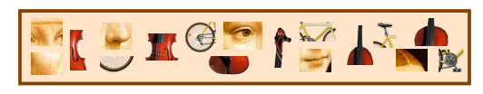

# Recognition

Visual Recognition

* Design algorithms that have the capability to:
  * Classify images or videos
  * Detect and localize objects
  * Estimate semantic and geometrical attributes
  * Classify human activities and events

Challenges:

* viewpoint variation
* illumination
* scale
* deformation
* occlusion
* background clutter
* intra-class variation

## K-nearest neighbor algorithm

Nearest Neighbor Classifier: Assign label of nearest training data point to each test data point

### K-nearest neighbor

Distance measure - Euclidean
$$
Dist(X^n,X^m) = \sqrt{\sum_{i=1}^D(X_i^n-X_i^m)^2}
$$

Problem:

* Choosing the value of k:
  * If too small, sensitive to noise points
  * If too large, neighborhood may include points from other
    classes
  * Solution: cross validate

* Can produce counter-intuitive results (using Euclidean measure)
  * Solution: normalize the vectors to unit length
* Curse of Dimensionality

## A simple Object Recognition pipeline

## Singular value decomposition

$$
A=U\Sigma V^T
$$

SVD can be used for image compression.

If A is a symmetric matrix, it can be decomposed as the following:
$$
A=\Phi\Sigma\Phi^T
$$

## Principal Component Analysis (PCA)

### Covariance

$$
covariance(x, y) = \frac{\sum_{i=1}^{n}(\bar{X}_i-X)(\bar{Y}_i-Y)}{n-1}
$$

Covariance matrix: Representing Covariance between dimensions as a matrix e.g. for 3 dimensions
$$
C = 
\begin{bmatrix}
 cov(x,x) & cov(x,y) & cov(x,z)\\
 cov(y,x) & cov(y,y) & cov(y,z)\\
 cov(z,x) & cov(z,y) & cov(z,z)
\end{bmatrix}
$$

* A positive value of covariance indicates both dimensions increase or decrease together.
* A negative value indicates while one increases the other decreases, or vice-versa.
* If covariance is zero: the two dimensions are independent of each other.

### PCA Formulation

Assume x is Gaussian with covariance $\Sigma$.
$$
X \sim  N(\mu, \Sigma)
$$
So
$$
\mu = E[X] = [E[X_1],\cdots, E[X_k]]^T \\
\Sigma = E[(X-\mu)(X-\mu)^T] = [cov[X_i,X_j]] (1\leq i,j\leq k)
$$
Since gaussians are symmetric, it’s covariance matrix is also a symmetric matrix. So we can express it as:
$$
\Sigma = U\Lambda U^T = U\Lambda^{\frac{1}{2}}(U\Lambda^{\frac{1}{2}})^T
$$
So
$$
\begin{align}
X \sim  N(\mu, \Sigma) &\Longleftrightarrow  X \sim \mu + U\Lambda^{\frac{1}{2}}N(0,I) \\
&\Longleftrightarrow X \sim \mu + UN(0,\Lambda) 
\end{align}
$$

* Principal components $\Phi_i$ are the eigenvectors of $\Sigma$
* Principal lengths $\lambda_i$ are the eigenvalues of $\Sigma$
* by computing the eigenvalues we know the data is 
  * Not flat if $\lambda_1 \approx \lambda_2$
  * Flat if $\lambda_i \gg \lambda_2$

### PCA Algorithm (training)

* Given sample $D=\{x_1,\cdots,x_n\},x_i\in \mathbb{R}^d$

  * compute sample mean: $\hat{\mu}=\frac{1}{n}\sum_i(x_i)$

  * compute sample covariance: $\hat{\Sigma} = \frac{1}{n}\sum_i(X_i-\mu)(X_i-\mu)^T$

  * compute eigenvalues and eigenvector of $\hat{\Sigma}$
    $$
    \hat{\Sigma}=\Phi\Lambda\Phi, \Lambda =diag(\sigma_1^2,\cdots,\sigma_n^2), \Phi\Phi^T=I
    $$

  * order the eigenvalues $\sigma_1^2 > \cdots > \sigma_n^2$

  * if, for a certain $k$, $\sigma_k \ll \sigma_1$ elimate the eigenvalues and eigenvectors above $k$

### PCA Algorithm (testing)

* Given principal compoenents $\phi_i, i\in1,\dots,k$ and a test sample $\mathcal{T}=\{t_1,\dots,t_n\}, t_i\in \mathcal{R}^d$

  * subtract mean to each point $t_i'=t_i - \hat{\mu}$

  * project onto eigenvector space $y_i=At_i'$ where
    $$
    A=\begin{bmatrix}
    \phi_1^T \\
    \vdots  \\
    \phi_k^T
    \end{bmatrix}
    $$

  * use $\mathcal{T}'=\{y_1,\dots,y_n\}$ to estimate class conditional densities and do all further processing on $y$

### PCA by SVD

$$
A = M \Pi N^T
$$

To relate this to PCA, we consider the data matrix:
$$
X = 
\begin{bmatrix}
|  &  & |\\
x_1  & \dots & x_n\\
|  &  & |
\end{bmatrix}
$$
The sample mean is:
$$
\mu = \frac{1}{n}\sum_i X_i = 
\frac{1}{n}
\begin{bmatrix}
|  &  & |\\
x_1  & \dots & x_n\\
|  &  & |
\end{bmatrix}
\begin{bmatrix}
1\\
\vdots\\
1
\end{bmatrix}
=\frac{1}{n}X^1
$$
Center the data by subtracting the mean to each column of $X$:
$$
X_c =
\begin{bmatrix}
|  &  & |\\
x_1  & \dots & x_n\\
|  &  & |
\end{bmatrix}
-
\begin{bmatrix}
|  &  & |\\
\mu  & \dots & \mu \\
|  &  & |
\end{bmatrix}
= X-\mu 1^T=X-\frac{1}{n}X^11^t
$$
The sample covariance matrix is
$$
\begin{align}
\Sigma &= \frac{1}{n}\sum_i(x_i-\mu)(x_i-\mu)^T \\
	   &=\frac{1}{n}\sum_ix_i^c(x_i^c)^T \\
	   &= \frac{1}{n}
	   \begin{bmatrix}
        |  &  & |\\
        x_1^c  & \dots & x_n^c\\
        |  &  & |
        \end{bmatrix}
        \begin{bmatrix}
        -  & x_1^c & -\\
          & \vdots & \\
        -  & x_n^c & -
        \end{bmatrix} \\
        &= \frac{1}{n}X_cX_c^t
\end{align}
$$
Let $X_c^T = M\Pi N^t$, so:
$$
\Sigma = \frac{1}{n}X_cX_c^T = \frac{1}{n}N\Pi M^TM\Pi N^T = \frac{1}{n}N\Pi^2N^T
$$

* The eigenvectors of $\Sigma$ are the columns of $N$

* The eigenvalues of $\Sigma$ are
  $$
  \lambda_i = \frac{1}{n}\pi_i^2
  $$

## The Eigenfaces Algorithm

* Assume that most face images lie on a low-dimensional subspace determined by the first k (k<<d) directions of maximum variance

* Use PCA to determine the vectors or “eigenfaces” that span that subspace
* Represent all face images in the dataset as linear combinations of eigenfaces

## Linear Discriminant Analysis (LDA)

Difference between PCA and LDA：

* PCA preserves maximum variance
* LDA preserves discrimination : Find projection that maximizes scatter between classes and minimizes scatter within classes

### LDA with 2 variables

We want to learn a projection W such that the projection converts all the points from x to a new space:
$$
z = w^Tx \quad z\in R^m \quad x\in R^n
$$
Let the per class means be:
$$
E_{X|Y}[X|Y=i]=\mu_i
$$
And the per class covariance matrices be:
$$
[(X-\mu_i)(X-\mu_i)^T|Y=i]=\Sigma_i
$$
We want a projection that maximizes:
$$
\begin{align}
J(w) &= \max \frac{\text{between class scatter}}{\text{within class scatter}} \\
	 &= \frac{(E_{Z|Y}[Z|Y=1]-E_{Z|Y}[Z|Y=0])^2}{var[Z|Y=1]+var[Z|Y=0]}
\end{align}
$$
$\because$
$$
\begin{align}
E_{Z|Y}[Z|Y=1]-E_{Z|Y}[Z|Y=0])^2 &= (w^T[\mu_1-\mu_0])^2 \\
	&= w^T[\mu_1-\mu_0][\mu_1-\mu_0]^Tw \\
var[Z|Y=i] &= E_{Z|Y}\{(z-E_{Z|Y}[Z|Y=i])^2|Y=i\} \\
	&= E_{Z|Y}\{(w^T[x-\mu_i])^2|Y=i\} \\
	&= E_{Z|Y}\{w^T[x-\mu_i][x-\mu_i]^Tw|Y=i\} \\
	&= w^T\Sigma_i w
\end{align}
$$
$\therefore$
$$
J(w) = \frac{w^TS_Bw}{w^TS_Ww} = \frac{w^T(\mu_1-\mu_0)(\mu_1-\mu_0)^Tw}{w^T(\Sigma_1+\Sigma_0)w}
$$

Maximizing the ratio
$$
J(w) = \frac{w^TS_Bw}{w^TS_Ww}
$$
Is equivalent to maximizing the numerator while keeping the denominator constant:
$$
\max_{w} w^TS_Bw \quad \text{subject to} \quad w^TS_Ww=K
$$
Using Lagrange multipliers:
$$
L=w^S_Bw -\lambda(w^TS_Ww-K)
$$
Setting the gradient of
$$
\nabla_{w}L=2(S_B-\lambda S_W)w = 0 \rightarrow S_Bw =\lambda S_Ww
$$
The solution is easy when
$$
S_W^{-1}=(\Sigma_1+\Sigma_0)^{-1}
$$
In this case:
$$
\begin{align}
S_W^{-1}S_Bw &=\lambda w \\
S_W^{-1}(\mu_1-\mu_0)(\mu_1-\mu_0)^Tw &=\lambda w
\end{align}
$$
Assuming that $(\mu_1-\mu_0)^Tw=\alpha$ is a scalar, this can be written as
$$
S_W^{-1}(\mu_1-\mu_0) = \frac{\lambda}{\alpha}w 
$$
and since we don’t care about the magnitude of $w$
$$
w^{*}=S_W^{-1}(\mu_1-\mu_0)=(\Sigma_1+\Sigma_0)^{-1}(\mu_1-\mu_0)
$$

### LDA with N variables and C classes

* $N$ Sample images: $\{x_1,\dots,x_N\}$
* $C$ classes: $\{Y_1,\dots,Y_c\}$
* Average of each class: $\mu_i = \frac{1}{N_i}\sum_{x_k\in Y_i} x_k$
* Average of all data: $\mu = \frac{1}{N}\sum_{k=1}^{N}x_k$
* Scatter of class i: $S_i = \sum_{x_k\in Y_i}(x_k-\mu_i)(x_k-\mu_i)^T$
* Within class scatter: $S_W = \sum_{i=1}^{c}S_i$
* Between class scatter: $S_B = \sum_{i=1}^{c}\sum_{j\neq i}(\mu_i-\mu_j)(\mu_i-\mu_j)^T$

We want to learn a projection W such that the projection converts all the points from x to a new space:
$$
z = w^Tx \quad z\in R^m \quad x\in R^n
$$
After projection:
$$
\tilde{S}_B=w^TS_Bw \\
\tilde{S}_W=w^TS_Ww
$$
So, the objective becomes:
$$
W_{opt}=\arg\max_{w}\frac{|\tilde{S}_B|}{|\tilde{S}_W|} = \frac{|w^TS_Bw|}{|w^TS_Ww|}
$$
Solve generalized eigenvector problem:
$$
S_Bw_i = \lambda_iS_Ww_i \quad i=1,\dots,m
$$

## Visual bag of words (BoW)

1. Extract features

   

   * Regular grid
   * Interest point detector
   * Random sampling
   * Segmentation-based patches

2. Learn “visual vocabulary”

   

   

3. Quantize features using visual vocabulary

   How to choose vocabulary size?

   * Too small: visual words not representative of all patches
   * Too large: quantization artifacts, overfitting

   Computational efficiency

   * Vocabulary trees

4. Represent images by frequencies of “visual words”

   

## Spatial Pyramid Matching

* Very useful for representing images.
* Pyramid is built by using multiple copies of image.
* Each level in the pyramid is 1/4 of the size of previous level.
* The lowest level is of the highest resolution.
* The highest level is of the lowest resolution.

## Naïve Bayes

Classify image using histograms of occurrences on visual words:

* $x_i$ is the event of visual word $v_i$ appearing in the image
* $N(i)$ the number of times word $v_i$ occurs in the image
* $m$ is the number of words in our vocabulary

Our goal is to classify that the image represented by $x$ is belongs class that has the highest posterior probability:
$$
c^{*} = \arg\max_{c}P(c|x)
$$

* Naïve Bayes classifier assumes that visual words are conditionally independent given object class.

* Model for image x under object class $c$:
  $$
  P(x|c) = \prod_{i=1}^{m}P(x_i|c)
  $$

* Class priors $P(c)$ encode how likely we are to see one class versus others.

* $$
  \sum_{i=1}^{m}P(c)=1
  $$

* Using Bayes Theorem
  $$
  \begin{align}
  P(c|x) &= \frac{P(c)P(x|c)}{\sum_{c'}P(c')P(x|c')} \\
  	&= \frac{P(c)\prod_{i=1}^{m} P(x_i|c)}{\sum_{c'}P(c')\prod_{i=1}^{m}P(x_i|c')}
  \end{align}
  $$

* We can now classify that the image represented by 𝒙 is belongs class that has the highest probability:
  $$
  c^{*}=\arg\max_c P(c|x) \\
  c^{*}=\arg\max_c \log P(c|x)
  $$

* $$
  P(c|x) \propto  P(c)\prod_{i=1}^{m} P(x_i|c) \\
  \log P(c|x) \propto \log P(c) + \sum_{i=1}^{m} P(x_i|c)
  $$

* $$
  c^{*} = \arg\max_{c} \log P(c) + \sum_{i=1}^{m} P(x_i|c)
  $$

