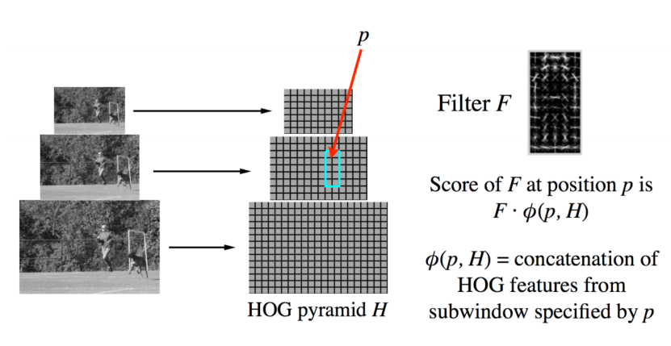
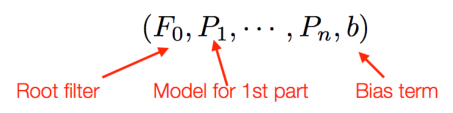
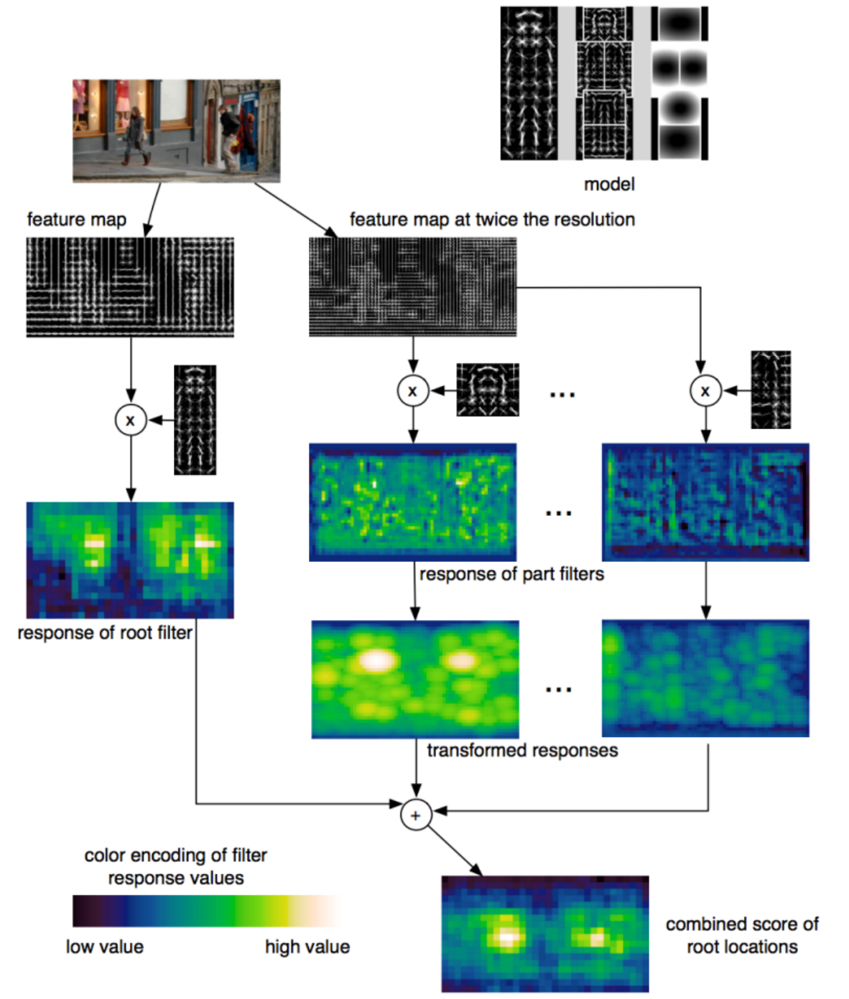

# Detection

## Object detection

Problem: Detecting and localizing generic objects from various categories, such as cars, people, etc.

Challenges:

* Illumination
* viewpoint
* deformations
* Intra-class variability

True positive: The overlap of the prediction with the ground truth is MORE than 0.5.

False positive: The overlap of the prediction with the ground truth is LESS than 0.5.
$$
precision = \frac{TP}{TP+FP} \\
recall = \frac{TP}{TP+FN}
$$

## A simple detector

## Deformable parts model

* Represents an object as a collection of parts arranged in a deformable
  configuration
* Each part represents local appearances
* Spring-like connections between certain pairs of parts
* The parts of an object form pairwise relationships.

**Deformable parts model**

* A model for an object with $n$ parts is a $n+2$ tuple:

  

* Each part-based model defined as:
  $$
  (F_i,v_i,d_i)
  $$

  * $F_i$ filter for the $i_{th}$ part
  * $v_i$ "anchor" position for part $i$ relative to the root position
  * $d_i$ defines a deformation cost for each possible placement of the part relative to the anchor position
  * $p_i=(x_i,y_i,l_i)$ specifies the level and position of the $i_{th}$ filter

* The score for a detection is defined as the sum of scores for the global and part detectors minus the sum of deformation costs for each part.
  $$
  \text{detection score} = \sum_{i=0}^{n} F_i\phi(p_i,H) - \sum_{i=1}^{n}d_i(\Delta x_i, \Delta y_i, \Delta x_i^2, \Delta y_i^2)
  $$
  * $\sum_{i=0}^{n} F_i\phi(p_i,H)$ : Scores for each part filter + global filter (similar to Dalal and Triggs).
  * $\Delta x_i$ : measures the distance in the x-direction from where part i should be.
  * $\Delta y_i$ : measures the same in the y-axis direction.
  * $d_i$ : is the weight associated for part i that penalizes the part for being away.

  

* Approach
  * Manually selected set of parts - Specific detector trained for each part
  * Spatial model trained on part activations
  * Evaluate joint likelihood of part activations
* Advantages
  * Parts have intuitive meaning.
  * Standard detection approaches can be used for each part.
  * Works well for specific categories.
* Disadvantages
  * Parts need to be selected manually
  * Semantically motivated parts sometimes don’t have a simple appearance distribution
  * No guarantee that some important part hasn’t been missed
  * When switching to another category, the model has to be rebuilt from scratch.