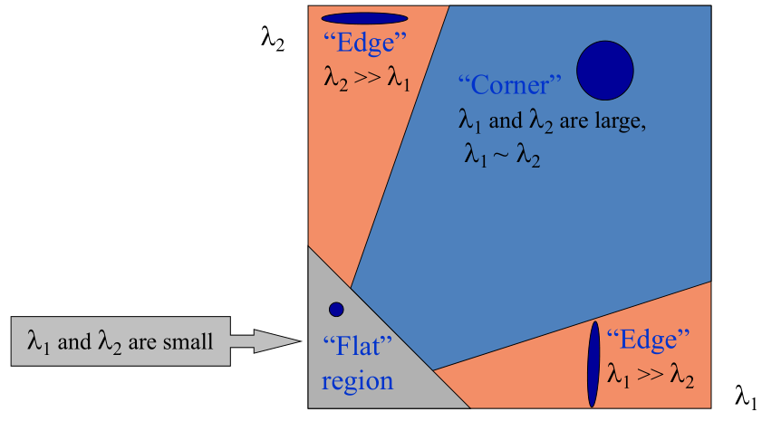
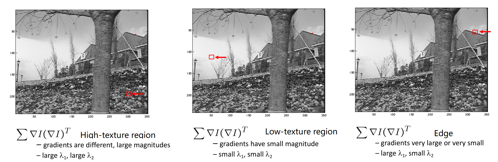
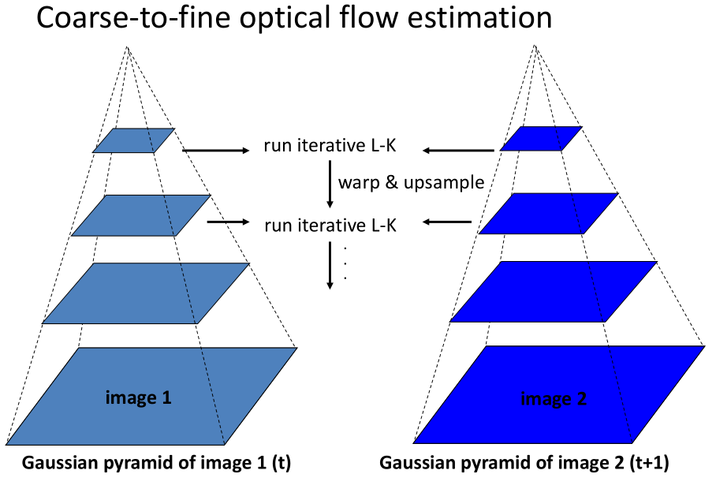
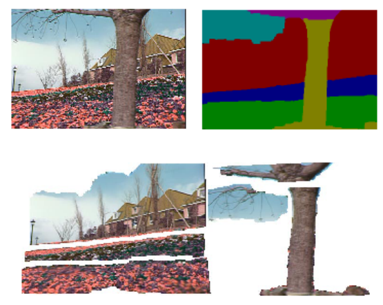
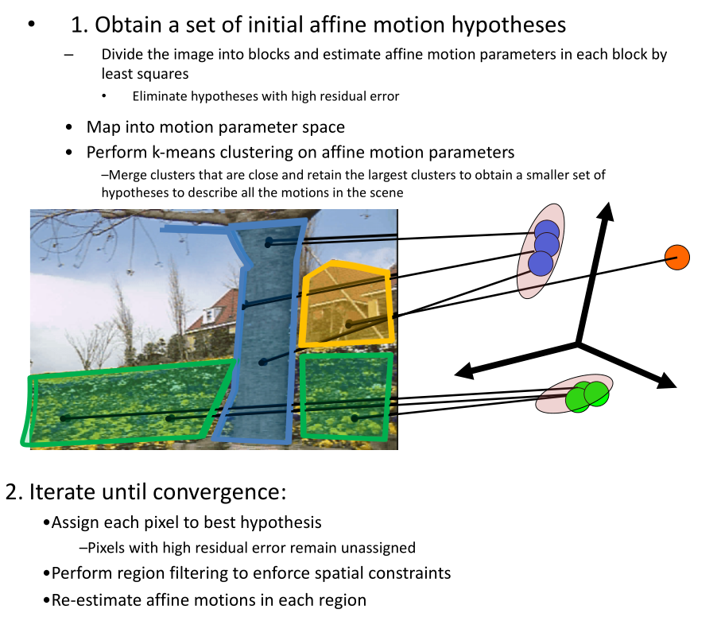

# Motion

## Optical flow

From images to videos

* A video is a sequence of frames captured over time
* Now our image data is a function of space $(x, y)$ and time $(t)$

**Optical flow**

* Definition: optical flow is the apparent motion of brightness patterns in the image
* Note: apparent motion can be caused by lighting changes without any actual motion
* GOAL: Recover image motion at each pixel from optical flow

### Estimating optical flow

* Given two subsequent frames, estimate the apparent motion field $u(x,y), v(x,y)$ between them

* Key assumptions

  * Brightness constancy: projection of the same point looks the same in every frame
    $$
    I(x,y,t) = I(x+u,y+v,t+1)
    $$
    Linearizing the right side using Taylor expansion:
    $$
    I(x+u,y+v,t+1) \approx I(x,y,t)+I_xu+I_yv+I_t \\
    I(x+u,y+v,t+1) - I(x,y,t) \approx I_xu+I_yv+I_t \\
    I_xu+I_yv+I_t \approx 0 \rightarrow \nabla I[u\ v]^T+I_t=0
    $$
  
* Small motion: points do not move very far
  
* Spatial coherence: points move like their neighbors

## Lucas-Kanade method

Spatial coherence constraint:

* Assume the pixel’s neighbors have the same $(u,v)$

   If we use a $5\times 5$ window, that gives us 25 equations per pixel
  $$
  I_{t}(p_i) + \nabla I(p_i)*[u\ v] \\
  \begin{bmatrix}
  I_x(p_1)  & I_y(p_1) \\
  \vdots  & \vdots \\
  I_x(p_{25}) & I_y(p_{25})
  \end{bmatrix}
  \begin{bmatrix}
   u \\
   v
  \end{bmatrix}=-
  \begin{bmatrix}
   I_t(p_1)\\
    \vdots \\
    I_t(p_{25})
  \end{bmatrix} \rightarrow Ad =b
  $$
  Least squares solution:
  $$
  (A^TA)d=A^Tb \rightarrow
  \begin{bmatrix}
   \sum I_xI_x & \sum I_xI_y \\
   \sum I_xI_y & \sum I_yI_y
  \end{bmatrix}
  \begin{bmatrix}
   u \\
   v
  \end{bmatrix} = -
  \begin{bmatrix}
   \sum I_xI_t \\
   \sum I_yI_t
  \end{bmatrix}
  $$

$$
A^TA = \begin{bmatrix}
 \sum I_xI_x & \sum I_xI_y \\
 \sum I_xI_y & \sum I_yI_y
\end{bmatrix} = \sum
\begin{bmatrix}
 I_x \\
 I_y
\end{bmatrix}
\begin{bmatrix}
 I_x & I_y
\end{bmatrix} = \sum \nabla I(\nabla I)^T
$$

* Eigenvectors and eigenvalues of ATA relate to edge direction and magnitude
  * The eigenvector associated with the larger eigenvalue points in the direction of fastest intensity change
  * The other eigenvector is orthogonal to it

**Improving accuracy**

* Recall our small motion assumption
  $$
  \begin{align}
  0 &= I(x+u,y+v)-I_{t=1}(x,y) \\
  &\approx I(x,y) + I_{x}u + I_{y}v - I_{t-1}(x,y)
  \end{align}
  $$
  To do better, we need to add higher order terms back in:
  $$
  \begin{align}
  0 &= I(x+u,y+v)-I_{t=1}(x,y) \\
  &= I(x,y) + I_{x}u + I_{y}v + \text{higher order terms} - I_{t-1}(x,y)
  \end{align}
  $$

* This is a polynomial root finding problem

  * Can solve using Newton’s method
  * Lukas-Kanade method does one iteration of Newton’s method

**Iterative Lukas-Kanade Algorithm**

1. Estimate velocity at each pixel by solving Lucas-Kanade equations
2. Warp $I(t-1)$ towards $I(t)$ using the estimated flow field
3. Repeat until convergence

## Pyramids for large motion

Purpose : points  move very far

## Horn-Schunk method

Problem : projection of the same point looks not the same in every frame

The flow is formulated as a global energy function which is should be minimized:
$$
E = \int\int [(I_xu+I_yv+I_t)^2+\alpha(\|\nabla u\|^2+\|\nabla v\|^2)]dxdy
$$

* The first part of the function is the brightness consistency.

* The second part is the smoothness constraint. It’s trying to make sure that the changes between pixels are small.

* $\alpha$ is a regularization constant. Larger values of 𝛼 lead to smoother flow.

* This minimization can be solved by taking the derivative with respect to u and v, we get the following 2 equations:
  $$
  I_x(I_xu+I_yv+I_t)-\alpha^2\Delta u = 0 \\
  I_y(I_xu+I_yv+I_t)-\alpha^2\Delta v = 0 
  $$

* Where $\Delta = \frac{\part^2}{\part x^2} + \frac{\part^2}{\part y^2}$ is called the Lagrange operator. In practice, it is measured using:
  $$
  \Delta u(x,y) = \bar{u}(x,y) - u(x,y)
  $$
  $\bar{u}(x,y)$ is the weighted average of u measured at $(x,y)$.

* So
  $$
  (I_x^2+\alpha^2)u+I_xI_yv=\alpha^2\bar{u}-I_xI_t \\
  I_xI_yu+(I_y^2+\alpha^2)v=\alpha^2\bar{v}-I_yI_t
  $$

* But since the solution depends on the neighboring values of the flow field, it must be repeated once the neighbors have been updated.

* So instead, we can iteratively solve for $u$ and $v$ using:
  $$
  u^{k+1}=\bar{u}^k-\frac{I_x(I_x\bar{u}^k+I_y\bar{v}^k+I_t)}{\alpha^2+I_x^2+I_y^2} \\
  v^{k+1}=\bar{v}^k-\frac{I_y(I_x\bar{u}^k+I_y\bar{v}^k+I_t)}{\alpha^2+I_x^2+I_y^2}
  $$

## Common fate

Problem : points move do not like their neighbors

### Motion segmentation

* Break image sequence into “layers” each of which has a coherent (affine) motion

  

Affine motion
$$
u(x,y) = a_1 + a_2x + a_3y \\
v(x,y) = a_4 + a_5x + a_6y
$$

* Substituting into the brightness constancy equation:
  $$
  I_xu+I_yv+I_t \approx 0 \\
  I_x(a_1 + a_2x + a_3y)+I_y(a_4 + a_5x + a_6y)+I_t \approx 0
  $$

* Least squares minimization:
  $$
  Err(\vec{a})=\sum [I_x(a_1 + a_2x + a_3y)+I_y(a_4 + a_5x + a_6y)+I_t]^2
  $$

## Applications

Uses of motion

* Tracking features
* Segmenting objects based on motion cues
* Learning dynamical models
* Improving video quality
  * Motion stabilization
  * Super resolution
* Tracking objects
* Recognizing events and activities