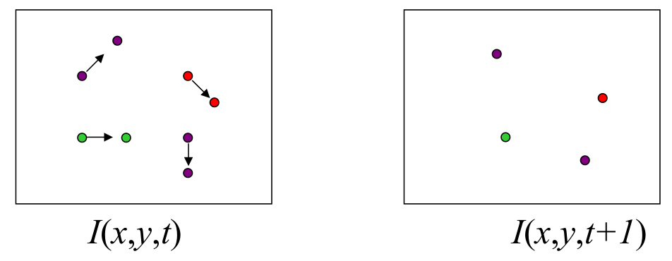

# Motion

## Optical flow

From images to videos

* A video is a sequence of frames captured over time
* Now our image data is a function of space $(x, y)$ and time $(t)$

**Optical flow**

* Definition: optical flow is the apparent motion of brightness patterns in the image
* Note: apparent motion can be caused by lighting changes without any actual motion
* GOAL: Recover image motion at each pixel from optical flow

### Estimating optical flow

* Given two subsequent frames, estimate the apparent motion field $u(x,y), v(x,y)$ between them

* Key assumptions

  * Brightness constancy: projection of the same point looks the same in every frame
    $$
    I(x,y,t) = I(x+u,y+v,t+1)
    $$
    Linearizing the right side using Taylor expansion:
    $$
    I(x+u,y+v,t+1) \approx I(x,y,t)+I_xu+I_yv+I_t \\
    I(x+u,y+v,t+1) - I(x,y,t) \approx I_xu+I_yv+I_t \\
    I_xu+I_yv+I_t \approx 0 \rightarrow \nabla I[u\ v]^T+I_t=0
    $$
    

  * Small motion: points do not move very far

  * Spatial coherence: points move like their neighbors